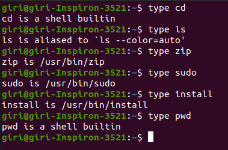

# Linux Vs Windows Operating System

## Linux Vs Windows

1. ***We can download the source code for linux, before you go for installation.***

	- https://github.com/torvalds/linux
	- sources for almost all software on linux also available.
	- Windows : source code will be secured & can't be viewed.
		
2. ***We can install updates without rebooting the whole machine***

	- Windows : Requires reboot after software updates.
		
3. ***We can plug devices in without worrying about finding/downloading drivers for it.***

	- exception : some higly specialized devices
	- Windows : requires us to download from internet
		
4. ***We can run linux without installing onto system from a Pendrive/CD/DVD etc ..***

	- Windows : There is no such facility
		
5. ***We can run linux for years without rebooting the machine***

	- ultra stable
	- less memory fragmentation
	- Windows : system becomes slower over a time.
		
6. ***We can run linux almost on any hardware***

	- limitation is based on requirement, as because linux has small & huge distributions.
	- Windows : minimum requirement is needed after uogradation
		
7. ***We can fix broken linux installs with a live CD***
	 
	 - sometimes even we can fix broken windows with linux live CD
	 - Windows : system repairs is only one option.
		
8. ***We can update whole drivers/packages/system on a single command***
	
	 - Windows : windows update settings
	
9. ***We can move a hard drive from one linux machine to another***
	 
	 - Windows : system often will not operates properly, also requires new license for it.
		
10. ***We can customize the icons, fonts, themes etc***
	 
	 - Windows : some customization is available only if we activated the windows product.
		
11. ***File system*** 
	 
	 - Linux : files are ordered in a tree structure starting with the root directory.
	 - Windows : files are stored in folders on different data drives like C: D: E:
	 - In Linux you can have 2 files with the same name in the same directory while in Windows, you cannot have 2 files with the same name in the same folder.
		
12. ***Security***
	 
	 - Linux is very well secure as it is easy to detect bugs and fix whereas Windows has a huge user base, so it becomes a target of hackers to attack windows system.
		
13. ***User accounts***
	 
	 - Windows : Administrator, Standard, Child, Guest 
	 - Linux : Regular, Root , Service Account
	 - Administrator & root users will have all administrative privileges.
		
14. ***Linux command type :***

	 - internal : which resides in internal memory.(shows as builtin)
	 - external : which resides in /usr/bin location.(shows /usr/bin location)
  	
	   type [command] : which gives the location of command.
		
	   
 
